## Alien Plant Comms 
### John Wu & Leo Morales - Computation Arts, Concordia University. April 13, 2023

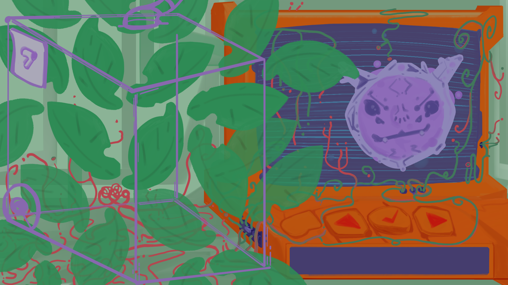

Alien Plant Comms is a 2 player cooperative game emphasizing communication to complete a series of mini-games and take care of an alien plant within a narrative setting.
Player's screens have complementary information about the tasks at hand, and the only way to progress through the stages of plant growth is to describe game states and discuss strategies to complete the various challenges, and figure out how to work the controls.

### Start screen:
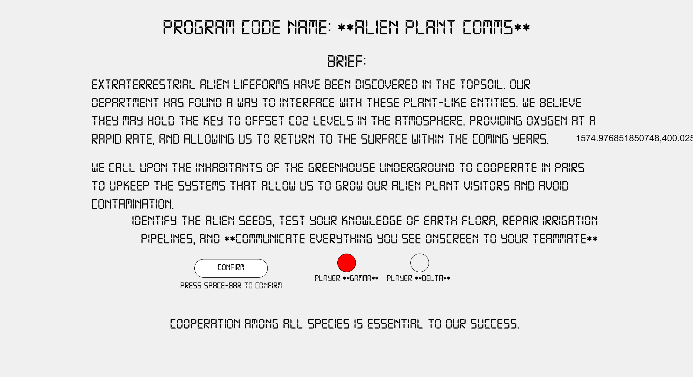

### Gameplay Screenshots:
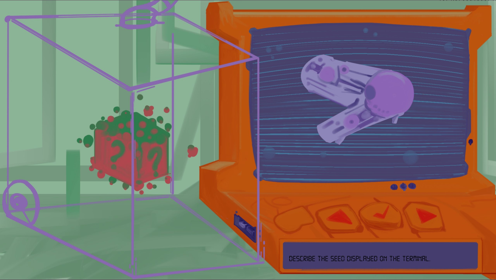
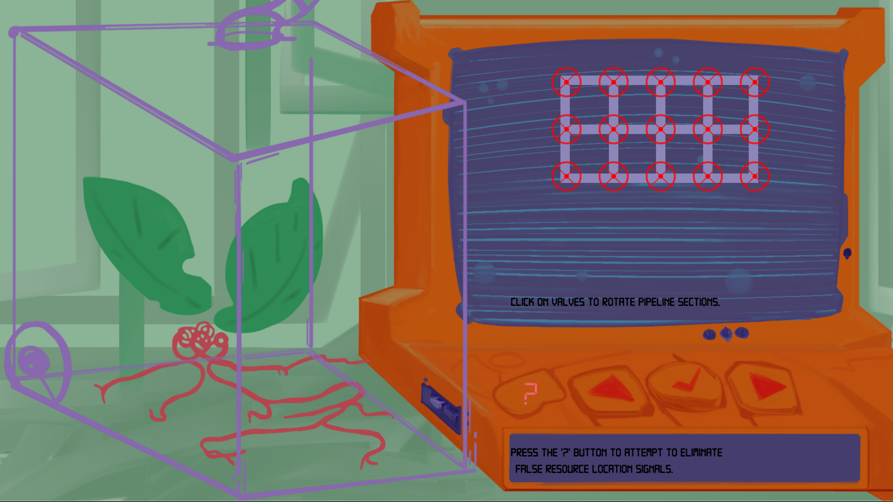
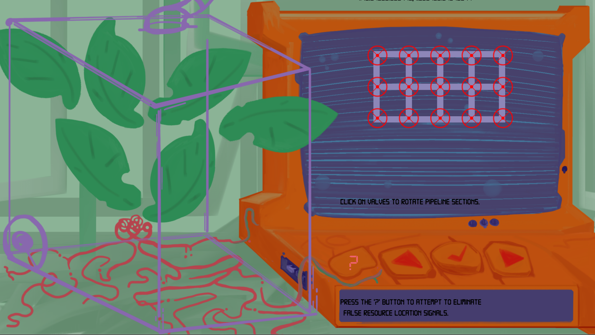
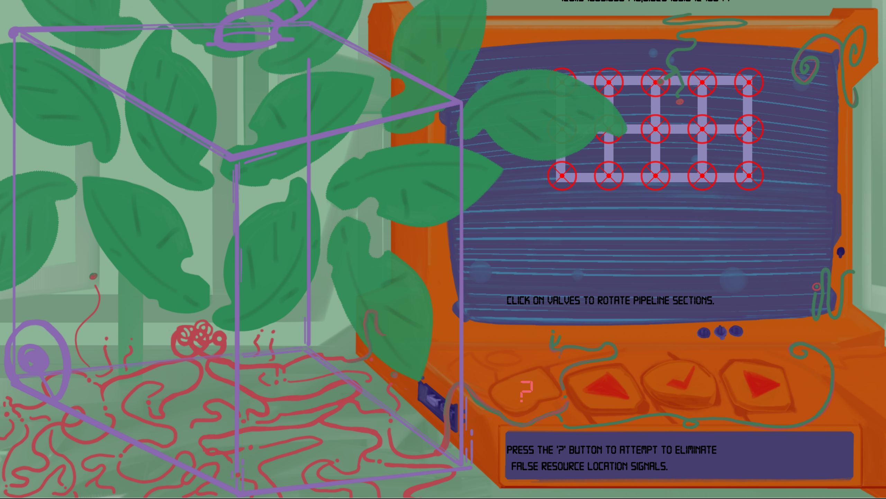
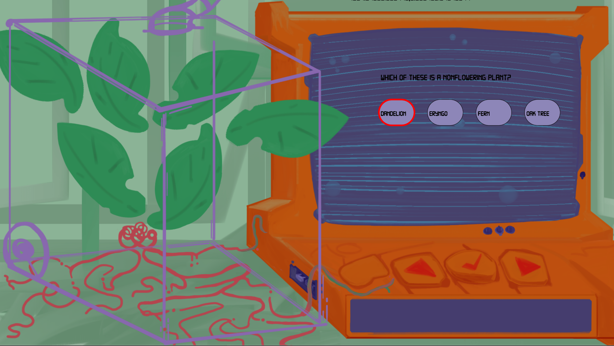
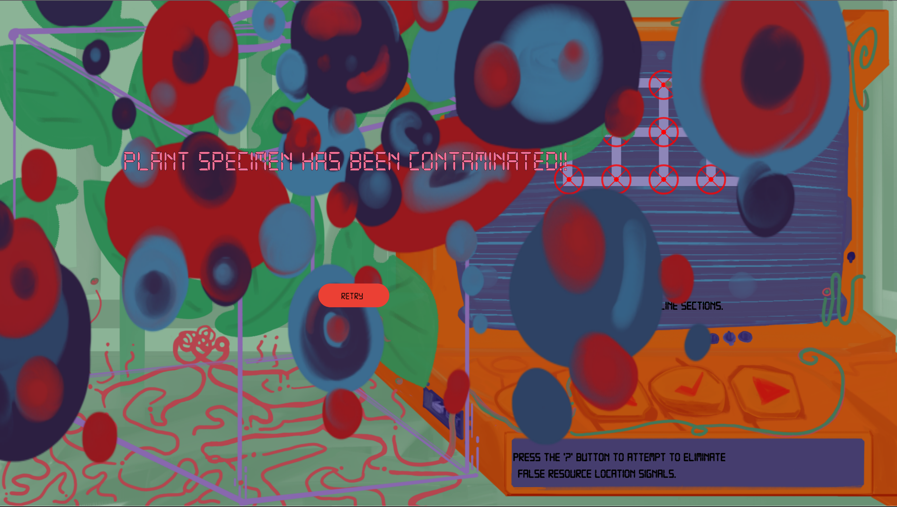
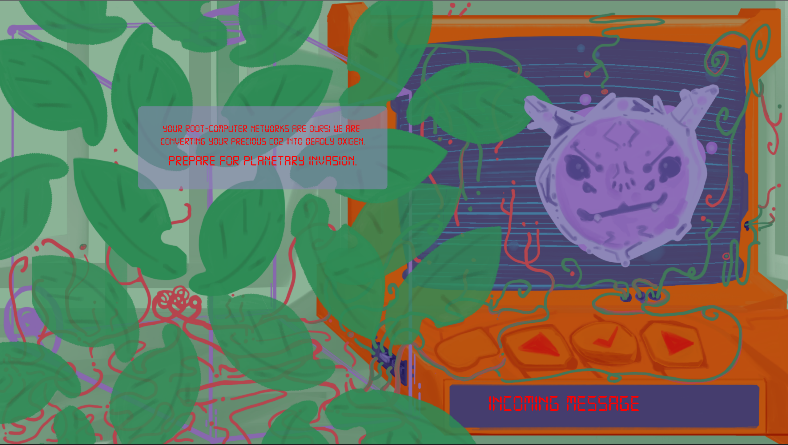
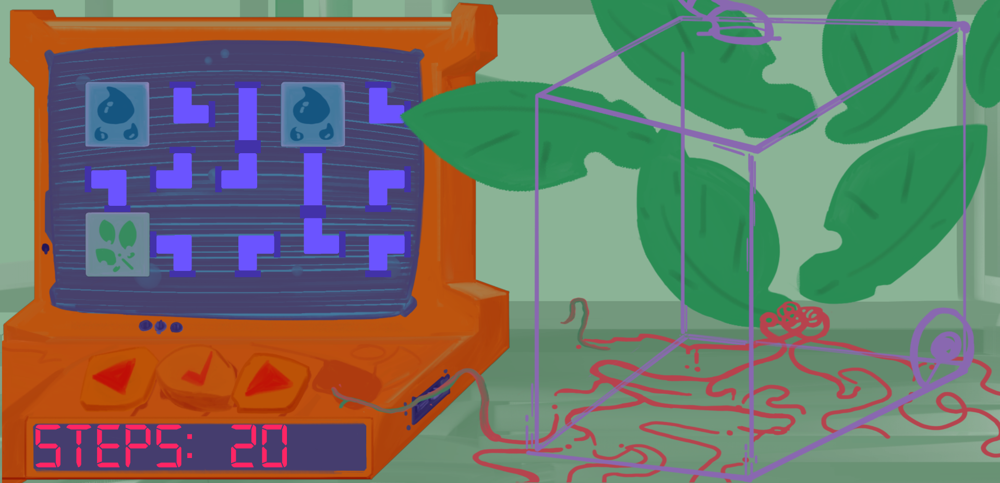
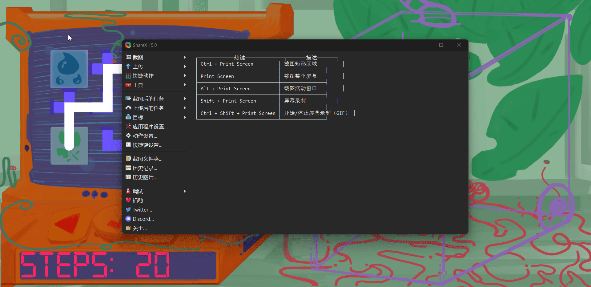
### How to play it:
1. Run the script.js file in project folders 'PlayerGAMMA' and 'PlayerDELTA' on separate computers with an internet connection. Or alternatively run each program on the web at: (!).

2. Players should be in the same physical space or in communication via video conferencing software to complete game actions successfully. 

3. Follow onscreen instructions to establish communication between the programs.

4. Converse with your teammate about the information displayed onscreen to progressively discover and complete game actions.
 

## Development:

### Playtest 2 - Final Critique Feedback:
 - Art style is both the game's greatest strength and weakness. It makes the UI very confusing and cluttered. It also makes the experience super engaging.
 - Difficulty of seed ID have might be too high.
 - The ramp-up time (time it takes to learn) for each mini-game is not proportional to the amount of time players spend playing those games. Very fast context switching.
 - Feels like a small piece of a larger, more complicated and long-term game.

### Playtest 1 Feedback:

**Focused iteration:**
Trading places. In terms of actions players have to take. << !
Story - Concept - Objective. Narrative framing - A sense of emergency  << !
Both screens have the interface << !
Have nature encroaching/invading the monitoring interface (art). << !
Visual cohesion. << !
Emphasize collaboration - cohabitation with plants. << !
If the timer runs out at any moment, show contaminated plant state. <<!

**Feedback:**
Keep talking and nobody explodes: maze minigame.
Plant didn’t have anything to do.
Lean on the resource management elements.
3 different resources that have to go to different places (pipes).
Trading places. In terms of actions players have to take. << !
Different actions/resources that have to be up-kept in different timings/cadence.
Implement actions on the plant. (Acting on it as a game object).
Story - Concept - Objective. << !
Narrative Cohesion - transitional elements.
Narrative framing.
Both screens have the interface? << !
Info on the interface changes in different ways for each player.
Controls - feel inconsistent in what they communicate as possible actions.
Keep each other’s screens hidden from each other (This is already intended).
Not red (monitoring interface).
Have nature encroaching/invading the monitoring interface (art). << !
Emphasize collaboration - cohabitation with plants.
VFX:make it look like a CRT video feed.
Visual cohesion. << !
Interface progresses into lighter colors as plants grow/get healthier.

### Ideation:
#### Concept sketches:
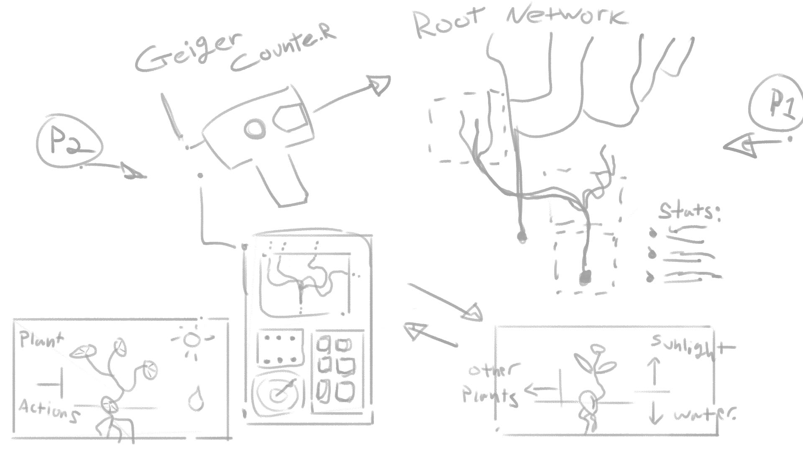
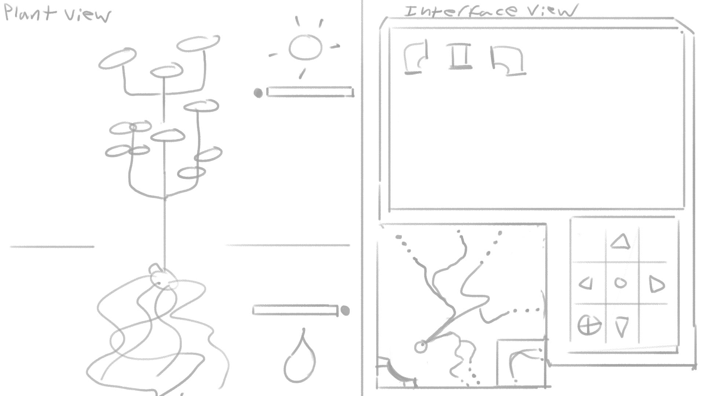
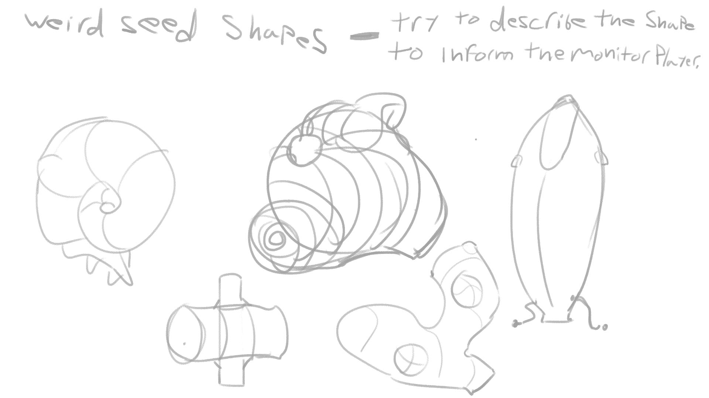
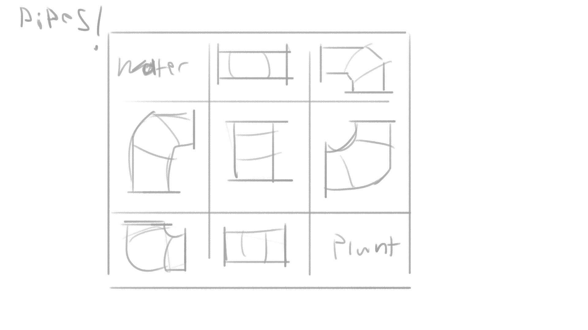

#### Brainstorming:
**2 player scifi-gardening plant communication puzzle experience:**

- One garden.
- One plant.
- 2 players, a monitoring interface device. 

**Plant:**
- Has different phases of growth: seed, sprout, small plant
- adult plant.
- Plants can communicate their needs to grow.
- There’s different types of plants and they have different needs. The Monitor does not initially know what type of plant exists in the garden.
- Plant player had to describe the plant for the Monitor to be able to unlock the corresponding resources.

**Monitoring device:**
Can control environmental conditions to help the plant based on their needs.
Unlocks resources by solving puzzles.
Pipe Puzzle: Place pipe pieces to make water flow from one end of the screen to another.
Root system puzzle: Design a path using pieces of root systems  to reach a defined water source location.
___ 

A plant that exists on your phone, can respond to gyroscope and microphone input and can be transferred from device to device (Pollinate!).

**Brainstorm:**
A rhizome of plants across devices.
Chemical comunicación between plants.
Plant senses.
Radiation.
Mapping root networks using radiation and a Giger counter.
Cross-species collaboration. Exchange of resources.
Plant 'memory'.
Responsive plants.
Plants as nodes in a network.

**Trade-offs and dynamics:**
Rise radiation levels to create/discover parts in the network.
Lower radiation levels by pollinating and expanding the network.
High radiation levels use up resources.
Pollinate other devices to enable them to gather resources/ produce more plants.
Gather resources by keeping healthy through pollination from other plant nodes and by discovering and expanding the network.

**Features:**
3d (webGL). (?)
Physics.
Transfer protocol.
Leafs growing, changing visual state /animation.
AR.**
Light sensitivity, sensors, solar tech. **

**Game Actions:**
Blow on the mic to pollinate.
Tip the device into another device to drop the whole plant.

**Progression and goal:**
Player actions make the plant grow.
Players gain some benefit by transferring the plant (pollinating).

**References/ inspiration:**
https://www.newyorker.com/magazine/2013/12/23/the-intelligent-plant | Plant Inteligence NYT article.
https://keeptalkinggame.com/ | Keep Talking and Nobody Explodes.
https://youtu.be/LOFsm3QrAAw | Bioshock, Hacking mini-game.

